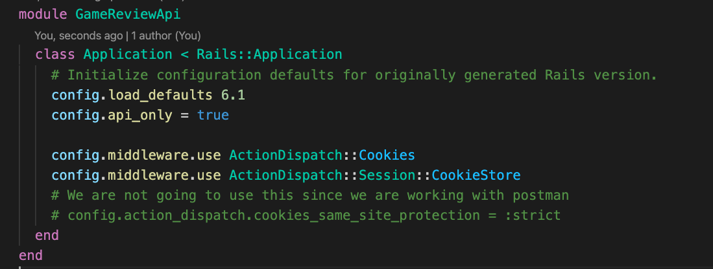
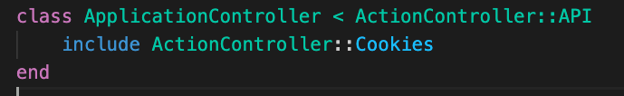
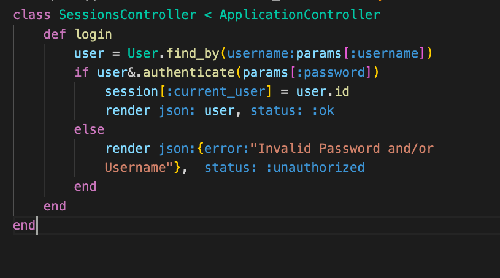
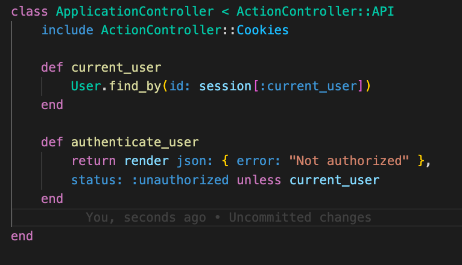

# Phase-4-112221-activity

# Deliverables
Create a rails app 

>Note: if you get stuck review Password Protection

You've been hired to create a Game Review app. It will have a React client and Rails api. 

1. Configure this app to work with cookies and sessions.
 

      

        solution 
      

      

        
           
      

 

2.  Add a login route.
 

      

        solution 
      

      

        
      

 

3. Add a sessions controller with a login action that saves the user_id to sessions. Take a moment to use byebug to check out the session hash. Verify you can login using postman.

   

      

        solution 
      

      

      
      

 

 4. In application controller, create two methods. `current_user`: checks to see if there's a current user in sessions. `authenticate_user`: assures that there is a current user otherwise sends an error, and the status:unauthorized

   

      

        solution 
      

      

      
      

 

Bonus 

5. Run authenticate_user before every action but login and user.create

6. Create a logout action

7. Log the users failed login attempts in sessions
 

